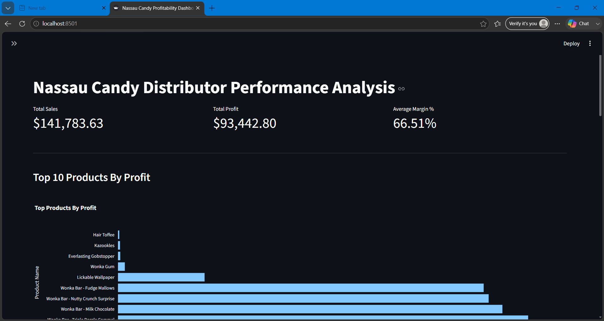
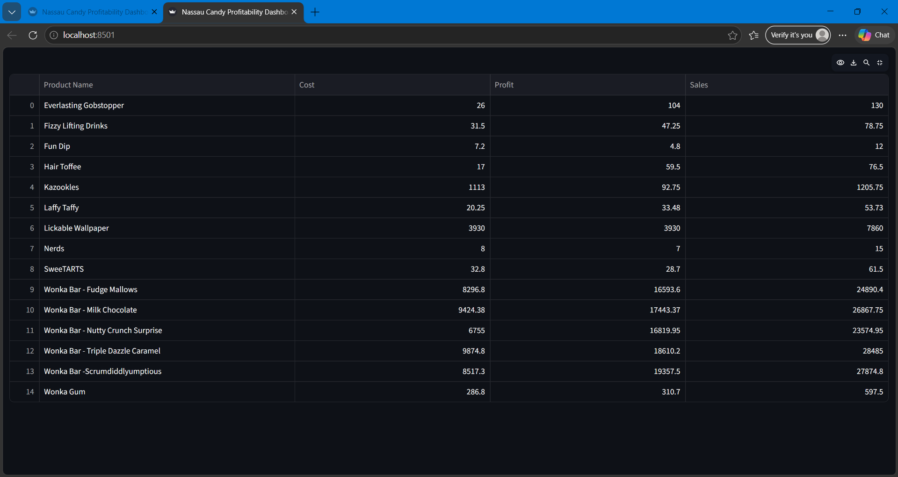
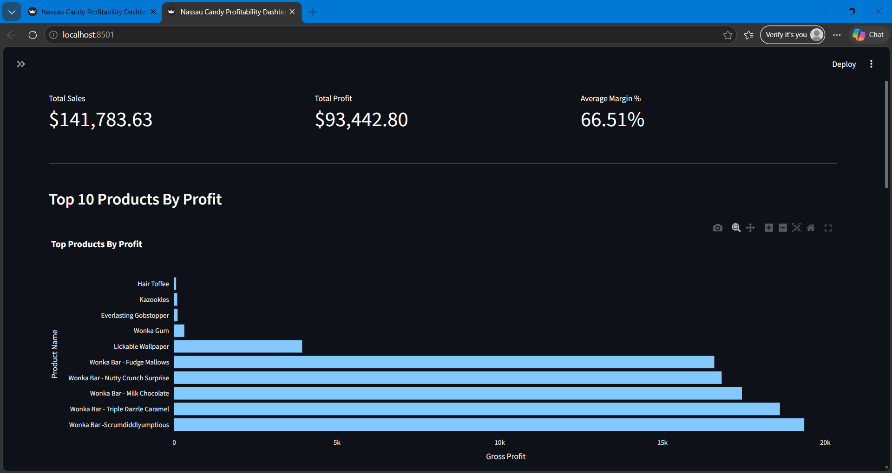
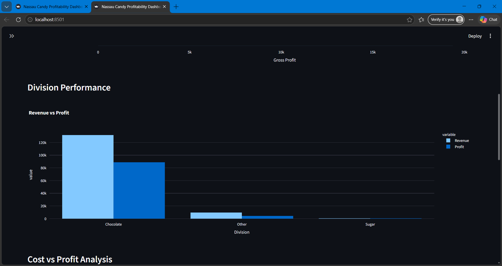
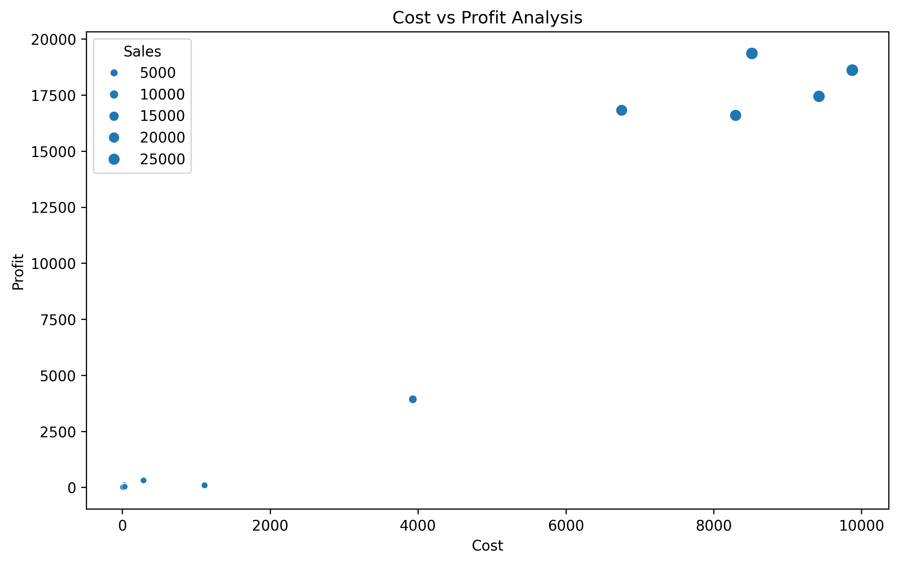
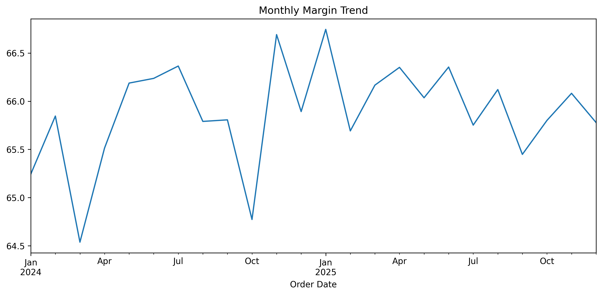

# Nassau Candy Distributor Performance Analysis
Sales and Profitability Analysis of Nassau Candy Distributor using Python, Pandas, Seaborn, Plotly and Streamlit


## Project Overview

This project analyzes the sales and profitability performance of Nassau Candy Distributor using Python, Pandas, Matplotlib, Seaborn, Plotly, and Streamlit.

The objective is to identify top-performing products, evaluate division-level performance, perform Pareto Analysis, and build an interactive dashboard for business insights.

---

## Dataset

The dataset contains transactional sales records with the following information:

- Order Details
- Customer Information
- Product Information
- Sales Revenue
- Gross Profit
- Cost
- Units Sold
- Geographic Information

Dataset Size:

- 10,194 Records
- 18 Columns

---

## Project Objectives

- Analyze product profitability
- Calculate Gross Margin Percentage
- Evaluate division performance
- Identify products contributing most profit
- Perform Pareto Analysis (80/20 Rule)
- Analyze Cost vs Profit relationships
- Track monthly margin trends
- Build an interactive Streamlit dashboard

---

## Technologies Used

### Programming Language

- Python 3.13

### Libraries

- Pandas
- NumPy
- Matplotlib
- Seaborn
- Plotly Express
- Streamlit

---

## Project Structure

```text
Nassau Candy Distributor Performance Analysis
│
├── data/
│   └── Nassau Candy Distributor.csv
│
├── Dashboard/
│   └── app.py
│
├── visuals/
│   ├── top10_products_profit.png
│   ├── division_performance.png
│   ├── pareto_analysis.png
│   ├── cost_vs_profit.png
│   └── monthly_margin_trend.png
│
├── analysis.py
│
├── requirements.txt
│
└── README.md
```

---

## Data Cleaning

The dataset was checked for:

- Missing Values
- Duplicate Records
- Data Type Consistency

Results:

- Missing Values: 0
- Duplicate Rows: 0

---

## Feature Engineering

### Gross Margin %

```python
Gross Margin % = (Gross Profit / Sales) * 100
```

### Profit Per Unit

```python
Profit Per Unit = Gross Profit / Units
```

---

## Analysis Performed

### 1. Product Performance Analysis

Calculated:

- Total Sales
- Total Profit
- Total Cost
- Total Units Sold
- Margin %

Identified top-performing products by profitability.

---

### 2. Division Analysis

Analyzed:

- Chocolate Division
- Sugar Division
- Other Division

Metrics:

- Revenue
- Profit
- Cost
- Units Sold
- Margin %

---

### 3. Pareto Analysis

Applied the 80/20 principle to identify products responsible for the majority of profits.

Finding:

A small number of Wonka products contribute approximately 80% of total company profit.

---

### 4. Cost vs Profit Analysis

Scatter plot analysis was used to examine the relationship between:

- Product Cost
- Gross Profit
- Sales Volume

---

### 5. Monthly Margin Trend Analysis

Monthly profitability trends were analyzed using:

- Monthly Sales
- Monthly Profit
- Monthly Margin %

---

## Dashboard Features

The Streamlit dashboard includes:

### KPI Cards

- Total Sales
- Total Profit
- Average Margin %

### Interactive Visualizations

- Top 10 Products by Profit
- Division Revenue vs Profit
- Cost vs Profit Scatter Plot

### Data Table

- Product Summary
- Sales
- Profit
- Cost

---

## Dashboard Screenshots

* Dashboard Overview


* Product Summary


* Top 10 Products by Profit


* Division Performance


* Cost vs Profit Analysis


* Monthly Margin Trend


## Key Insights

### Financial Performance

- Total Sales: $141,783.63
- Total Profit: $93,442.80
- Average Margin: 66.51%

### Product Insights

Top Profit Generating Products:

1. Wonka Bar - Scrumdiddlyumptious
2. Wonka Bar - Triple Dazzle Caramel
3. Wonka Bar - Milk Chocolate
4. Wonka Bar - Nutty Crunch Surprise
5. Wonka Bar - Fudge Mallows

### Division Insights

- Chocolate Division generated the highest revenue and profit.
- Sugar Division contributed the least revenue.

### Pareto Findings

Approximately 80% of profit is generated by a small group of Wonka products.

---

## Running the Analysis

Install dependencies:

```bash
pip install -r requirements.txt
```

Run the analysis script:

```bash
python analysis.py
```

---

## Running the Dashboard

Navigate to the project folder and run:

```bash
python -m streamlit run Dashboard/app.py
```

The dashboard will open in your browser at:

```text
http://localhost:8501
```

---

## Future Improvements

- Customer Segmentation Analysis
- Regional Performance Dashboard
- Sales Forecasting
- Inventory Optimization
- Profitability Prediction Models

---

## Author

Pranali Khapne

Computer Science and Engineering Student

Data Analytics Project

Tools Used:
Python | Pandas | Seaborn | Plotly | Streamlit

---